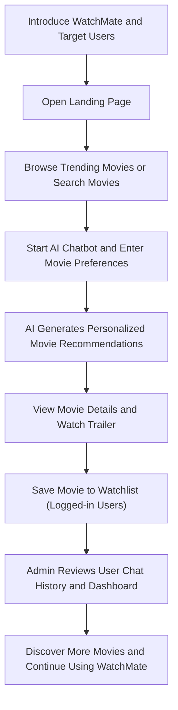

```mermaid
flowchart TD
    A["Introduce WatchMate and Target Users"] --> B["Open Landing Page"]
    B --> C["Browse Trending Movies or Search Movies"]
    C --> D["Start AI Chatbot and Enter Movie Preferences"]
    D --> E["AI Generates Personalized Movie Recommendations"]
    E --> F["View Movie Details and Watch Trailer"]
    F --> G["Save Movie to Watchlist (Logged-in Users)"]
    G --> H["Admin Reviews User Chat History and Dashboard"]
    H --> I["Discover More Movies and Continue Using WatchMate"]
```
