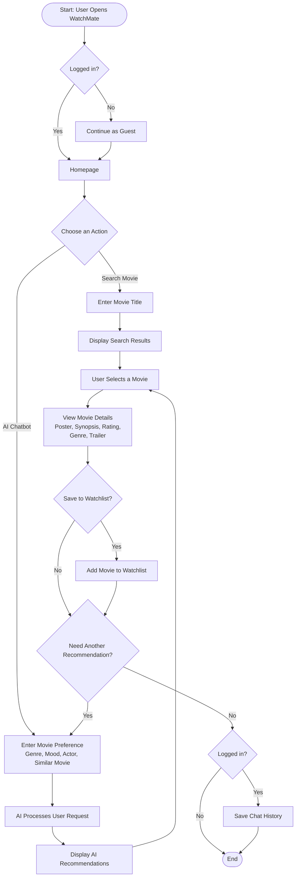

# User Flow Diagram

```mermaid
flowchart TD

A([Start: User Opens WatchMate])

A --> B{Logged in?}

B -->|Yes| C[Homepage]
B -->|No| D[Continue as Guest]

D --> C

C --> E{Choose an Action}

E -->|Search Movie| F[Enter Movie Title]
E -->|AI Chatbot| G[Enter Movie Preference<br/>Genre, Mood, Actor, Similar Movie]

F --> H[Display Search Results]
G --> I[AI Processes User Request]

H --> J[User Selects a Movie]
I --> K[Display AI Recommendations]

K --> J

J --> L[View Movie Details<br/>Poster, Synopsis, Rating,<br/>Genre, Trailer]

L --> M{Save to Watchlist?}

M -->|Yes| N[Add Movie to Watchlist]
M -->|No| O{Need Another Recommendation?}

N --> O

O -->|Yes| G
O -->|No| P{Logged in?}

P -->|Yes| Q[Save Chat History]
P -->|No| R([End])

Q --> R
```
