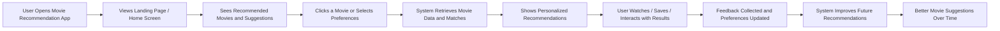

```mermaid
flowchart LR
    A[User Opens Movie Recommendation App] --> B[Views Landing Page / Home Screen]
    B --> C[Sees Recommended Movies and Suggestions]
    C --> D[Clicks a Movie or Selects Preferences]
    D --> E[System Retrieves Movie Data and Matches]
    E --> F[Shows Personalized Recommendations]
    F --> G[User Watches / Saves / Interacts with Results]
    G --> H[Feedback Collected and Preferences Updated]
    H --> I[System Improves Future Recommendations]
    I --> J[Better Movie Suggestions Over Time]
```
