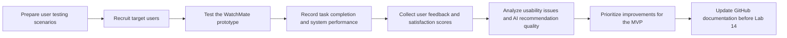

```mermaid
flowchart LR
    A["Prepare user testing scenarios"] --> B["Recruit target users"]
    B --> C["Test the WatchMate prototype"]
    C --> D["Record task completion and system performance"]
    D --> E["Collect user feedback and satisfaction scores"]
    E --> F["Analyze usability issues and AI recommendation quality"]
    F --> G["Prioritize improvements for the MVP"]
    G --> H["Update GitHub documentation before Lab 14"]
```
